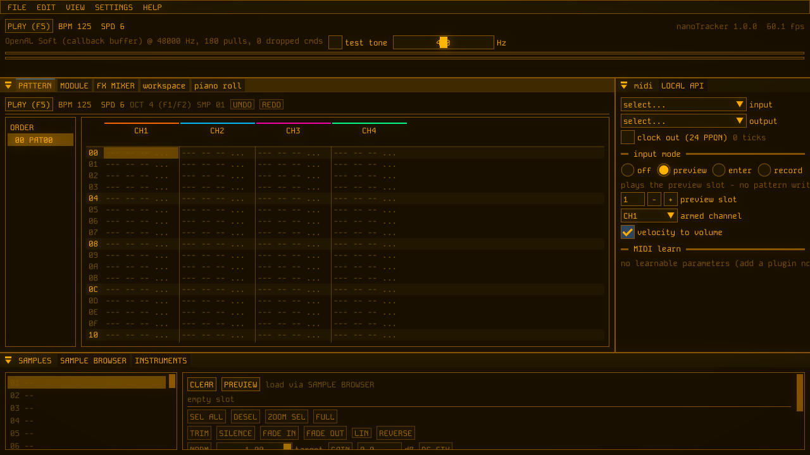

<div align="center">

# NanoTracker

**A native music tracker with patch cables, plugins and hardware MIDI.**

[](https://github.com/savannah-i-g/nanotracker/actions/workflows/ci.yml)
[](https://github.com/savannah-i-g/nanotracker/releases)
[](LICENSE)
[](CMakeLists.txt)
[](#download)

[Download](#download) · [Features](#features) ·
[Building](#building) · [Writing plugins](#writing-plugins) ·
[Docs](Docs/)



</div>

Pattern sequencing, a patchable workspace of audio, CV, gate and MIDI
cables, plugin hosting three ways, hardware MIDI with a phase-locked
clock, module import, and studio-grade export, in a single fast
desktop app built on OpenAL Soft, OpenGL and Dear ImGui.

NanoTracker began as a web application. This repository is the native
port and the project's home going forward. The web build serves as the
behavioural reference: where it was broken, the native app fixes it
and records the divergence in [Docs/FIXES.md](Docs/FIXES.md).

## Features

- Classic tracker pattern editor with block selection, clipboard,
  transpose and interpolation, plus polyphonic piano-roll sequence
  layers with a full transform toolbox (quantize, humanize,
  arpeggiate, velocity curves and more)
- Patchable workspace: typed cables (audio, sidechain, CV, gate,
  MIDI) between tracker channels, plugins and utility nodes, with
  legal feedback loops (one-block delay)
- Plugin hosting three ways: the declarative NTP format (MIT-licensed
  headers, samplers, wavetables, granular, native DSP stages), CLAP,
  and VST3, with native editor windows for both external formats
- Sampler platform: user-assignable sample slots that travel inside
  project files, MPC-style slice maps, destructive waveform editing
  with undo
- MIDI: hardware in and out on cables, a phase-locked 24 PPQN clock,
  pattern record and step entry, MIDI learn, row-effect translation
  to CC and pitch bend
- Export: WAV (16/24/32f), OGG and MP3, order ranges, per-channel
  stems with ZIP bundling, fades, peak, true-peak and LUFS
  normalization (BS.1770-4 via libebur128), metadata and presets
- Module import: MOD, XM, S3M and IT, with every approximation
  counted and reported, never silent
- Remote control: a localhost WebSocket API with a typed command
  schema, token auth and a built-in status window
- FTRK project format, fully specified in
  [Docs/ftrk-format.md](Docs/ftrk-format.md)

## Download

Grab the latest build from the
[releases page](https://github.com/savannah-i-g/nanotracker/releases):

- **Linux**: AppImage (x86_64). Make it executable and run it.
- **Windows**: portable zip (x64). **Beta**: CI-built and tested,
  awaiting confirmation on real hardware from the community. Reports
  are very welcome.

Per-commit Windows artifacts are also produced by
[CI](https://github.com/savannah-i-g/nanotracker/actions).

## Building

Requirements: CMake 3.24 or newer, a C++20 compiler (GCC on Linux,
MSVC 2022 on Windows), Python 3 with `jinja2`. Dependencies are
fetched and pinned by CMake; the full roster with versions and
licences is [Docs/DEPENDENCIES.md](Docs/DEPENDENCIES.md).

### Linux

System packages (Debian/Ubuntu names): `libopenal-dev`,
`libasound2-dev`, `libx11-dev`, `libgl1-mesa-dev`, `python3-jinja2`,
and either `libopenmpt-dev` or a vendored build via
`tools/build_libopenmpt.sh`. Optional: `libmp3lame0` enables MP3
export at run time.

```sh
cmake -B build -DCMAKE_BUILD_TYPE=Release
cmake --build build -j
ctest --test-dir build --output-on-failure
./build/nanotracker
```

### Windows

MSVC 2022 is required (the VST3 SDK does not support MinGW). OpenAL
Soft is built from source and shipped beside the executable, and
libopenmpt comes from the upstream prebuilt package, both handled by
CMake automatically.

```sh
cmake -B build -G Ninja -DCMAKE_BUILD_TYPE=Release
cmake --build build -j
ctest --test-dir build --output-on-failure
```

## Tests

A single Catch2 suite covers the engine against golden traces, the
graph compiler, format round-trips, importers against binary
fixtures, plugin hosting against in-tree CLAP and native-stage
fixtures, convolution null tests, MIDI (live when a loopback device
exists, skipped cleanly headless), the Local API over a real
WebSocket client, and offline export down to LUFS accuracy. The same
suite runs under ASan/UBSan in a second tree and on both CI
platforms.

## Writing plugins

The NTP plugin format is declarative JSON in a ZIP archive. The
headers under [include/ntp/](include/ntp/) are MIT licensed with a
plugin exception, so plugin authors are never copyleft-bound. Native
DSP stages (compiled code inside an archive) use the versioned C ABI
in `include/ntp/ntp_stage_abi.h`; archives that contain native code
are labelled loudly in the UI.

## Licence

GPLv3 (see [LICENSE](LICENSE)), with the deliberate exception above
for `include/ntp/`. Third-party dependency licences are collected in
[LICENSES/](LICENSES/).
